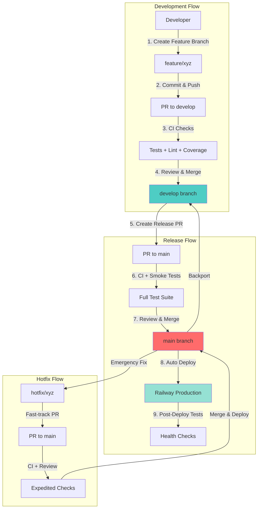
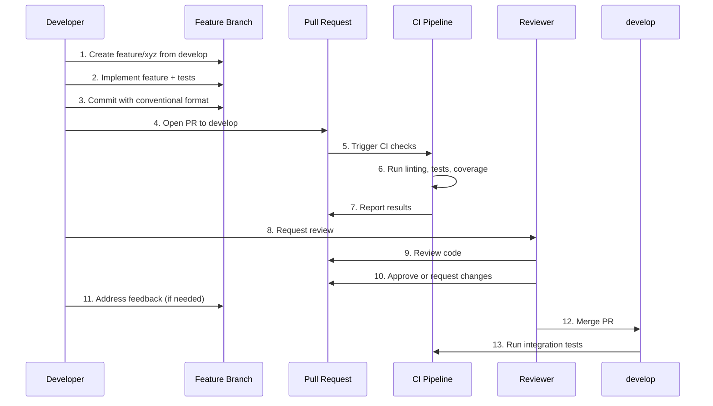
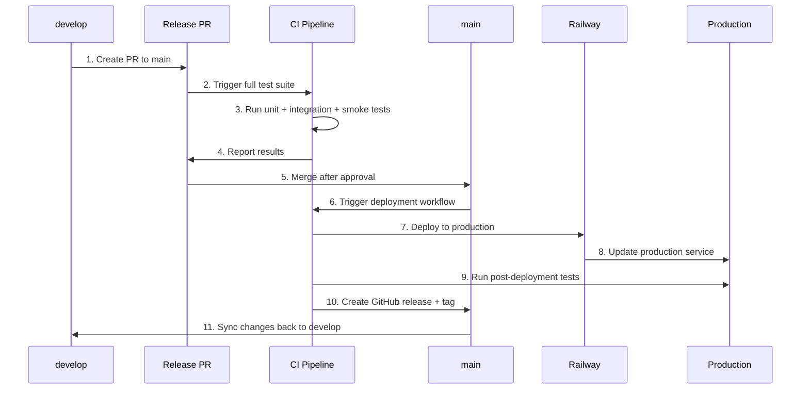
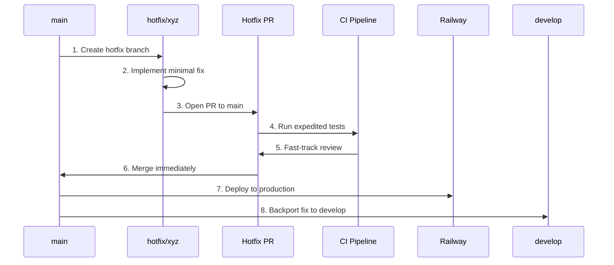

# Design Document: GitHub CI/CD and Production Workflow

## Overview

This design establishes a comprehensive GitHub-based CI/CD pipeline with production and development branch workflows for the Rose AI Companion application. The system will automate testing, enforce code quality, manage deployments, and provide a clear development workflow that supports both rapid iteration and production stability.

## Architecture

### High-Level Workflow



### Branch Strategy

```
main (production)
├── Tag: v1.0.0 (current production baseline)
├── Tag: v1.1.0 (future releases)
└── develop (integration)
    ├── feature/user-authentication
    ├── feature/enhanced-memory
    ├── fix/audio-processing-bug
    └── chore/dependency-updates
```

## Components and Interfaces

### 1. GitHub Actions Workflows

#### Workflow: CI/CD Pipeline (`ci-cd.yml`)

**Purpose**: Comprehensive testing and deployment pipeline

**Triggers**:
- Push to `main` or `develop`
- Pull requests to `main` or `develop`

**Jobs**:

```yaml
jobs:
  # Job 1: Code Quality
  code-quality:
    - Checkout code
    - Setup Python 3.12 + uv
    - Install dependencies
    - Run ruff linting
    - Run ruff formatting check
    - Run mypy type checking
    
  # Job 2: Unit Tests
  unit-tests:
    depends-on: code-quality
    - Run pytest with coverage
    - Generate coverage reports (XML, HTML, terminal)
    - Upload to Codecov
    - Enforce 70% coverage threshold
    - Upload HTML coverage as artifact
    
  # Job 3: Integration Tests
  integration-tests:
    depends-on: code-quality
    condition: branch == 'develop' OR pull_request
    - Run integration tests with real APIs
    - Non-blocking (failures don't stop pipeline)
    
  # Job 4: Smoke Tests
  smoke-tests:
    depends-on: [unit-tests]
    condition: branch == 'main' OR target_branch == 'main'
    - Run deployment validation tests
    - Build Docker image
    - Test container startup
    - Verify health endpoint
    - Test critical API endpoints
    
  # Job 5: Deploy to Production
  deploy-production:
    depends-on: [unit-tests, smoke-tests]
    condition: branch == 'main' AND event == 'push'
    - Install Railway CLI
    - Deploy to Railway production service
    - Wait for deployment (max 5 minutes)
    - Verify deployment health
    - Run post-deployment smoke tests
    - Create GitHub release with tag
    
  # Job 6: Deploy to Staging (future)
  deploy-staging:
    depends-on: [unit-tests]
    condition: branch == 'develop' AND event == 'push'
    - Deploy to Railway staging service
    - Run staging tests
```

#### Workflow: PR Validation (`pr-validation.yml`)

**Purpose**: Validate pull request quality and format

**Triggers**:
- Pull request opened, synchronized, reopened

**Checks**:
```yaml
jobs:
  pr-checks:
    - Validate PR title (conventional commits)
    - Check required files exist
    - Detect large files (>1MB warning)
    - Verify no secrets in code
    - Check for merge conflicts
    - Validate branch naming convention
```

#### Workflow: Release Management (`release.yml`)

**Purpose**: Automate release creation and versioning

**Triggers**:
- Push to `main` branch (after successful deployment)

**Actions**:
```yaml
jobs:
  create-release:
    - Determine version number (semantic versioning)
    - Generate changelog from commits
    - Create GitHub release
    - Tag commit with version
    - Update CHANGELOG.md
    - Notify team via webhook
```

#### Workflow: Dependency Updates (`dependency-updates.yml`)

**Purpose**: Automated dependency management

**Triggers**:
- Schedule: Weekly on Monday 9 AM UTC
- Manual trigger

**Actions**:
```yaml
jobs:
  update-dependencies:
    - Run uv lock --upgrade
    - Run npm update in frontend/
    - Run tests with updated dependencies
    - Create PR if tests pass
    - Label PR as "dependencies"
```

### 2. Branch Protection Rules

#### Main Branch Protection

```yaml
Branch: main
Settings:
  require_pull_request_reviews:
    required_approving_review_count: 1
    dismiss_stale_reviews: true
    require_code_owner_reviews: false
    
  require_status_checks:
    strict: true  # Require branch to be up to date
    contexts:
      - "code-quality"
      - "unit-tests"
      - "smoke-tests"
      
  enforce_admins: true
  
  restrictions:
    allow_force_pushes: false
    allow_deletions: false
    
  require_linear_history: true
  require_signed_commits: false  # Optional, can enable later
```

#### Develop Branch Protection

```yaml
Branch: develop
Settings:
  require_pull_request_reviews:
    required_approving_review_count: 1
    dismiss_stale_reviews: false
    
  require_status_checks:
    strict: false  # Allow merging without being up to date
    contexts:
      - "code-quality"
      - "unit-tests"
      
  enforce_admins: false
  
  restrictions:
    allow_force_pushes: false
    allow_deletions: false
    
  require_linear_history: false
```

### 3. GitHub Secrets Configuration

**Required Secrets**:

```yaml
# API Keys (for testing and deployment)
GROQ_API_KEY: "gsk_..."
ELEVENLABS_API_KEY: "sk_..."
ELEVENLABS_VOICE_ID: "21m00Tcm4TlvDq8ikWAM"
QDRANT_URL: "https://xyz.qdrant.io"
QDRANT_API_KEY: "..."
TOGETHER_API_KEY: "..."  # Optional, for image generation tests

# Deployment
RAILWAY_TOKEN: "..."  # From: railway whoami --token
RAILWAY_PRODUCTION_URL: "https://rose-production.railway.app"
RAILWAY_STAGING_URL: "https://rose-staging.railway.app"  # Future

# Code Coverage
CODECOV_TOKEN: "..."  # From codecov.io

# Notifications (optional)
SLACK_WEBHOOK_URL: "..."  # For deployment notifications
DISCORD_WEBHOOK_URL: "..."  # Alternative notification channel
```

### 4. Railway Deployment Configuration

#### Production Service Configuration

```json
{
  "name": "rose-production",
  "builder": "NIXPACKS",
  "buildCommand": "uv sync && cd frontend && npm install && npm run build && cd ..",
  "startCommand": "uv run uvicorn src.ai_companion.interfaces.chainlit.app:app --host 0.0.0.0 --port $PORT",
  "healthcheckPath": "/api/health",
  "healthcheckTimeout": 30,
  "restartPolicyType": "ON_FAILURE",
  "restartPolicyMaxRetries": 3,
  "volumes": [
    {
      "mountPath": "/app/data",
      "name": "rose-production-data"
    }
  ],
  "environmentVariables": {
    "ENVIRONMENT": "production",
    "LOG_LEVEL": "INFO",
    "SENTRY_ENVIRONMENT": "production"
  }
}
```

#### Staging Service Configuration (Future)

```json
{
  "name": "rose-staging",
  "builder": "NIXPACKS",
  "buildCommand": "uv sync && cd frontend && npm install && npm run build && cd ..",
  "startCommand": "uv run uvicorn src.ai_companion.interfaces.chainlit.app:app --host 0.0.0.0 --port $PORT",
  "healthcheckPath": "/api/health",
  "healthcheckTimeout": 30,
  "restartPolicyType": "ON_FAILURE",
  "restartPolicyMaxRetries": 3,
  "volumes": [
    {
      "mountPath": "/app/data",
      "name": "rose-staging-data"
    }
  ],
  "environmentVariables": {
    "ENVIRONMENT": "staging",
    "LOG_LEVEL": "DEBUG",
    "SENTRY_ENVIRONMENT": "staging"
  }
}
```

## Data Models

### Workflow State Tracking

```python
# .github/workflows/state.json (generated during workflow)
{
  "workflow_run_id": "12345678",
  "commit_sha": "abc123...",
  "branch": "main",
  "triggered_by": "push",
  "timestamp": "2025-10-23T10:30:00Z",
  "jobs": {
    "code-quality": {"status": "success", "duration": 45},
    "unit-tests": {"status": "success", "duration": 120, "coverage": 75.2},
    "smoke-tests": {"status": "success", "duration": 180},
    "deploy-production": {"status": "success", "duration": 240}
  },
  "deployment": {
    "environment": "production",
    "url": "https://rose-production.railway.app",
    "version": "v1.1.0",
    "health_check": "passed"
  }
}
```

### Release Metadata

```yaml
# Generated in GitHub Release
version: v1.1.0
tag: v1.1.0
commit: abc123def456
date: 2025-10-23T10:35:00Z
changelog:
  features:
    - "feat: add enhanced memory retrieval"
    - "feat: improve voice processing latency"
  fixes:
    - "fix: resolve audio buffer overflow"
    - "fix: correct memory extraction edge case"
  chores:
    - "chore: update dependencies"
deployment:
  environment: production
  url: https://rose-production.railway.app
  deployed_at: 2025-10-23T10:35:00Z
  deployed_by: github-actions
```

## Error Handling

### Workflow Failure Scenarios

#### 1. Test Failures

**Detection**: Pytest returns non-zero exit code

**Response**:
```yaml
- name: Run tests
  run: uv run pytest tests/ --cov=src
  continue-on-error: false  # Stop workflow
  
- name: Upload test results on failure
  if: failure()
  uses: actions/upload-artifact@v4
  with:
    name: test-results
    path: |
      htmlcov/
      pytest-report.xml
      
- name: Comment on PR with failure details
  if: failure() && github.event_name == 'pull_request'
  uses: actions/github-script@v7
  with:
    script: |
      github.rest.issues.createComment({
        issue_number: context.issue.number,
        owner: context.repo.owner,
        repo: context.repo.repo,
        body: '❌ Tests failed. Check the workflow logs for details.'
      })
```

#### 2. Deployment Failures

**Detection**: Railway deployment fails or health check fails

**Response**:
```yaml
- name: Deploy to Railway
  id: deploy
  run: railway up --service rose-production
  timeout-minutes: 5
  
- name: Verify deployment
  id: verify
  run: |
    sleep 30
    curl -f ${{ secrets.RAILWAY_PRODUCTION_URL }}/api/health || exit 1
    
- name: Rollback on failure
  if: failure() && steps.deploy.outcome == 'success'
  run: |
    echo "Deployment verification failed. Manual rollback required."
    echo "Previous deployment should still be running."
    exit 1
    
- name: Notify team of deployment failure
  if: failure()
  uses: slackapi/slack-github-action@v1
  with:
    webhook-url: ${{ secrets.SLACK_WEBHOOK_URL }}
    payload: |
      {
        "text": "🚨 Production deployment failed",
        "blocks": [
          {
            "type": "section",
            "text": {
              "type": "mrkdwn",
              "text": "*Production Deployment Failed*\n\nCommit: ${{ github.sha }}\nWorkflow: ${{ github.run_id }}\n\nAction required: Check logs and rollback if necessary."
            }
          }
        ]
      }
```

#### 3. Coverage Threshold Failures

**Detection**: Coverage below 70%

**Response**:
```yaml
- name: Check coverage threshold
  run: |
    uv run pytest tests/ \
      --cov=src \
      --cov-fail-under=70 \
      --quiet
  continue-on-error: false
  
- name: Comment coverage report on PR
  if: github.event_name == 'pull_request'
  uses: codecov/codecov-action@v4
  with:
    token: ${{ secrets.CODECOV_TOKEN }}
    fail_ci_if_error: true
```

### Rollback Procedures

#### Automatic Rollback Triggers

1. **Post-deployment health check fails**
   - Railway maintains previous deployment
   - Manual rollback via Railway dashboard
   - Document in incident log

2. **Post-deployment smoke tests fail**
   - Alert team immediately
   - Provide rollback instructions
   - Create incident ticket

#### Manual Rollback Process

```bash
# Via Railway CLI
railway login
railway link rose-production
railway status  # View deployment history
railway rollback  # Rollback to previous deployment

# Via Railway Dashboard
# 1. Navigate to project
# 2. Go to Deployments tab
# 3. Click on previous successful deployment
# 4. Click "Redeploy"
```

## Testing Strategy

### Test Pyramid

```
                    ┌─────────────┐
                    │   E2E Tests │  (5%)
                    │  Playwright │
                    └─────────────┘
                  ┌───────────────────┐
                  │ Integration Tests │  (20%)
                  │  Real API Calls   │
                  └───────────────────┘
              ┌─────────────────────────────┐
              │      Unit Tests             │  (75%)
              │  Mocked Dependencies        │
              └─────────────────────────────┘
```

### Test Execution Strategy

#### Pull Request Tests (Fast)
```bash
# Run in parallel
pytest tests/unit/ -n auto --cov=src --cov-report=xml
pytest tests/integration/ -m "not slow" || true  # Non-blocking
```

#### Pre-Deployment Tests (Comprehensive)
```bash
# Run sequentially for accuracy
pytest tests/unit/ --cov=src --cov-fail-under=70
pytest tests/integration/ -m "smoke"
pytest tests/test_deployment.py -k "not TestDeployedInstance"
```

#### Post-Deployment Tests (Verification)
```bash
# Test against live production
pytest tests/test_deployment.py::TestDeployedInstance -v
pytest tests/test_smoke.py -v
```

### Test Environment Configuration

```yaml
# tests/.env.ci
ENVIRONMENT=ci
LOG_LEVEL=WARNING
GROQ_API_KEY=${GROQ_API_KEY}
ELEVENLABS_API_KEY=${ELEVENLABS_API_KEY}
ELEVENLABS_VOICE_ID=${ELEVENLABS_VOICE_ID}
QDRANT_URL=${QDRANT_URL}
QDRANT_API_KEY=${QDRANT_API_KEY}
SHORT_TERM_MEMORY_DB_PATH=:memory:  # Use in-memory SQLite for tests
```

## Development Workflow

### Feature Development Flow



### Release Flow



### Hotfix Flow



## Monitoring and Observability

### Workflow Metrics

**Tracked Metrics**:
- Build duration (target: <5 minutes)
- Test execution time (target: <3 minutes)
- Deployment time (target: <5 minutes)
- Test success rate (target: >95%)
- Coverage percentage (target: >70%)
- Deployment frequency (target: multiple per day)

**Metric Collection**:
```yaml
- name: Record metrics
  run: |
    echo "build_duration_seconds=${{ job.duration }}" >> metrics.txt
    echo "test_coverage_percent=${{ steps.coverage.outputs.coverage }}" >> metrics.txt
    echo "deployment_timestamp=$(date +%s)" >> metrics.txt
    
- name: Upload metrics
  uses: actions/upload-artifact@v4
  with:
    name: workflow-metrics
    path: metrics.txt
```

### Deployment Notifications

**Slack Notification Template**:
```json
{
  "text": "✅ Production Deployment Successful",
  "blocks": [
    {
      "type": "section",
      "text": {
        "type": "mrkdwn",
        "text": "*Production Deployment*\n\n*Version:* v1.1.0\n*Commit:* abc123\n*Deployed by:* @developer\n*Duration:* 4m 32s\n*Coverage:* 75.2%\n\n<https://rose-production.railway.app|View Production> | <https://github.com/org/repo/actions/runs/123|View Workflow>"
      }
    }
  ]
}
```

### Health Monitoring

**Post-Deployment Health Checks**:
```bash
#!/bin/bash
# scripts/health-check.sh

URL=$1
MAX_RETRIES=10
RETRY_DELAY=5

for i in $(seq 1 $MAX_RETRIES); do
  echo "Health check attempt $i/$MAX_RETRIES..."
  
  # Check health endpoint
  if curl -f "$URL/api/health" > /dev/null 2>&1; then
    echo "✅ Health check passed"
    
    # Check critical endpoints
    curl -f "$URL/api/session/start" > /dev/null 2>&1 || exit 1
    
    echo "✅ All checks passed"
    exit 0
  fi
  
  echo "⏳ Waiting ${RETRY_DELAY}s before retry..."
  sleep $RETRY_DELAY
done

echo "❌ Health check failed after $MAX_RETRIES attempts"
exit 1
```

## Security Considerations

### Secret Management

1. **Never commit secrets to repository**
   - Use GitHub Secrets for all sensitive data
   - Validate .env files are in .gitignore
   - Use secret scanning in workflows

2. **Rotate secrets regularly**
   - API keys: Every 90 days
   - Deployment tokens: Every 180 days
   - Document rotation procedures

3. **Least privilege access**
   - Railway tokens: Service-specific
   - GitHub tokens: Minimal required scopes
   - API keys: Read-only when possible

### Code Security

```yaml
# Add to workflow
- name: Scan for secrets
  uses: trufflesecurity/trufflehog@main
  with:
    path: ./
    base: ${{ github.event.repository.default_branch }}
    head: HEAD
    
- name: Dependency vulnerability scan
  run: |
    uv pip install pip-audit
    uv run pip-audit
```

## Documentation Updates

### Files to Create/Update

1. **`.github/workflows/ci-cd.yml`** - Main CI/CD pipeline
2. **`.github/workflows/pr-validation.yml`** - PR validation
3. **`.github/workflows/release.yml`** - Release automation
4. **`.github/PULL_REQUEST_TEMPLATE.md`** - PR template
5. **`.github/CODEOWNERS`** - Code ownership
6. **`docs/GITHUB_WORKFLOW.md`** - Workflow documentation
7. **`docs/BRANCH_STRATEGY.md`** - Branch strategy guide
8. **`docs/DEPLOYMENT_GUIDE.md`** - Update with new workflows
9. **`CONTRIBUTING.md`** - Update with new workflow
10. **`README.md`** - Add CI/CD badges and status

### Documentation Structure

```markdown
# docs/GITHUB_WORKFLOW.md

## Overview
- Branch strategy
- Workflow triggers
- Deployment process

## Developer Guide
- Creating feature branches
- Opening pull requests
- Addressing review feedback
- Merging process

## Deployment Guide
- Automatic deployments
- Manual deployments
- Rollback procedures
- Troubleshooting

## Maintenance
- Updating workflows
- Managing secrets
- Monitoring metrics
```

## Migration Plan

### Phase 1: Initial Setup (Day 1)

1. Create `develop` branch from current `main`
2. Tag current `main` as `v1.0.0` (production baseline)
3. Set up branch protection rules
4. Configure GitHub Secrets

### Phase 2: Workflow Implementation (Day 1-2)

1. Create CI/CD workflow file
2. Create PR validation workflow
3. Test workflows with sample PRs
4. Verify Railway deployment integration

### Phase 3: Documentation (Day 2)

1. Update CONTRIBUTING.md
2. Create workflow documentation
3. Update README with badges
4. Create PR templates

### Phase 4: Team Onboarding (Day 3)

1. Team walkthrough of new workflows
2. Practice creating PRs
3. Test deployment process
4. Document lessons learned

### Phase 5: Production Cutover (Day 3)

1. Merge all pending work to `develop`
2. Create release PR from `develop` to `main`
3. Deploy to production via new workflow
4. Monitor for issues
5. Celebrate! 🎉

## Future Enhancements

### Short-term (1-3 months)

1. **Staging Environment**
   - Deploy `develop` to Railway staging
   - Run extended tests in staging
   - Manual promotion to production

2. **Performance Testing**
   - Add Locust load tests to CI
   - Track response time trends
   - Alert on performance regressions

3. **Security Scanning**
   - SAST with Semgrep
   - Dependency scanning with Snyk
   - Container scanning

### Long-term (3-6 months)

1. **Advanced Deployment Strategies**
   - Canary deployments
   - Blue-green deployments
   - Automatic rollback on errors

2. **Enhanced Monitoring**
   - APM integration (Sentry, DataDog)
   - Custom metrics dashboard
   - Automated incident response

3. **Multi-environment Support**
   - Development environment
   - QA environment
   - Production environment
   - Environment-specific configurations
