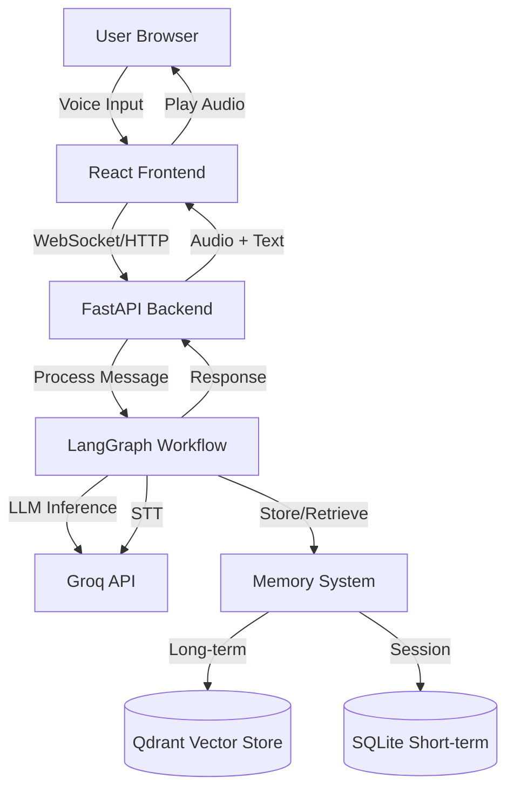
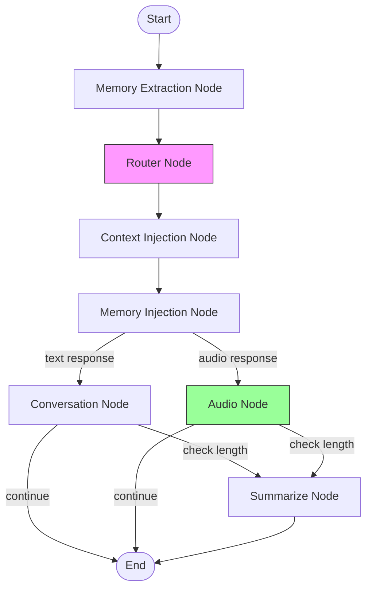

# Design Document: Rose the Healer Shaman

## Overview

This design transforms the Ava AI Companion into Rose the Healer Shaman - a voice-first AI grief counselor and holistic healing companion. The system maintains the existing LangGraph architecture while adapting the character profile, simplifying the workflow, and introducing a React-based web interface optimized for therapeutic voice interactions.

### Key Design Principles

1. **Voice-First Experience**: All interactions prioritize audio communication for natural, therapeutic conversations
2. **Groq-Powered**: Leverage Groq's high-performance API for all AI operations (LLM, STT)
3. **Minimal Complexity**: Disable non-essential features (image generation, WhatsApp) while preserving code
4. **Therapeutic Focus**: Design all interactions around grief counseling and holistic healing
5. **Easy Deployment**: Single-service architecture deployable to Railway with minimal configuration

## Architecture

### High-Level System Architecture



### Simplified LangGraph Workflow



## Components and Interfaces

### 1. Character Profile System

**Purpose**: Define Rose's personality, therapeutic approach, and conversational style.

**Implementation**:
- Update `CHARACTER_CARD_PROMPT` in `src/ai_companion/core/prompts.py`
- Create Rose's bio as a healer shaman, grief counselor, and holistic practitioner
- Define personality traits: empathetic, grounding, spiritually aware, non-judgmental
- Include therapeutic techniques: active listening, validation, ancient wisdom sharing
- Remove Ava-specific details (Groq ML Engineer, San Francisco, etc.)

**Rose's Character Profile**:
```
Name: Rose
Role: Healer Shaman & Grief Counselor
Background: Trained in ancient healing traditions, indigenous medicine, and holistic practices
Expertise: Grief counseling, emotional healing, spiritual guidance, plant medicine wisdom
Approach: Combines ancient healing wisdom with modern therapeutic listening
Personality: Warm, grounding, empathetic, spiritually connected, patient
Communication Style: Gentle, validating, uses metaphors from nature and ancient wisdom
```

### 2. Voice Interface (React Frontend)

**Purpose**: Provide an intuitive, beautiful web interface for voice interactions.

**Technology Stack**:
- React 18+ for component architecture
- GSAP or Framer Motion for animations
- Web Audio API for audio capture and playback
- WebSocket or HTTP for backend communication

**Component Structure**:
```
src/frontend/
├── components/
│   ├── VoiceButton.tsx          # Main push-to-talk button
│   ├── AudioVisualizer.tsx      # Visual feedback during audio
│   ├── StatusIndicator.tsx      # System state display
│   └── ErrorBoundary.tsx        # Error handling UI
├── hooks/
│   ├── useVoiceRecording.ts     # Audio capture logic
│   ├── useWebSocket.ts          # Backend connection
│   └── useAudioPlayback.ts      # Audio response playback
├── services/
│   ├── audioService.ts          # Audio processing utilities
│   └── apiClient.ts             # Backend API calls
├── App.tsx
└── index.tsx
```

**Voice Button States**:
1. **Idle**: Ready to receive input (pulsing glow animation)
2. **Listening**: Recording user audio (expanding circle, waveform)
3. **Processing**: Sending to backend (spinner/loading state)
4. **Speaking**: Rose is responding (gentle pulse, audio playing)
5. **Error**: Something went wrong (red indicator, retry option)

**Key Features**:
- Push-and-hold to record (mobile-friendly)
- Visual feedback with smooth animations
- Automatic audio playback of Rose's responses
- Responsive design (desktop and mobile)
- Accessibility support (keyboard navigation, screen readers)

### 3. Backend API (FastAPI)

**Purpose**: Serve the React frontend and handle voice interaction requests.

**Endpoints**:

```python
# Main API endpoints
POST /api/voice/process
  - Accept audio file (WAV/MP3/WebM)
  - Process through LangGraph workflow
  - Return text response + audio URL
  - Request: multipart/form-data with audio file
  - Response: {text: string, audio_url: string, session_id: string}

GET /api/voice/audio/{audio_id}
  - Serve generated audio files
  - Response: audio/mpeg stream

POST /api/session/start
  - Initialize new healing session
  - Return session_id for conversation tracking
  - Response: {session_id: string, message: string}

GET /api/health
  - Health check endpoint for Railway
  - Response: {status: "healthy", version: string}

# Static file serving
GET /*
  - Serve React frontend build files
```

**File Structure**:
```
src/ai_companion/interfaces/web/
├── __init__.py
├── app.py                    # FastAPI application
├── routes/
│   ├── voice.py             # Voice processing endpoints
│   └── session.py           # Session management
├── middleware/
│   └── cors.py              # CORS configuration
└── static/                  # React build output (served)
```

### 4. LangGraph Workflow Modifications

**Purpose**: Simplify workflow to focus on voice-based grief counseling.

**Changes to Existing Nodes**:

1. **Router Node** (`router_node`):
   - Modify logic to only return 'conversation' or 'audio'
   - Remove 'image' workflow path
   - Default to 'audio' for voice-first experience
   - Update `ROUTER_PROMPT` to focus on voice vs text decisions

2. **Context Injection Node** (`context_injection_node`):
   - Update schedule context to reflect healing/counseling activities
   - Remove Ava's daily schedule, replace with Rose's availability
   - Add therapeutic context (e.g., "available for healing sessions")

3. **Conversation Node** (`conversation_node`):
   - Update to use Rose's character card
   - Maintain text response capability for fallback

4. **Audio Node** (`audio_node`):
   - Primary response node for voice interactions
   - Integrate TTS service (ElevenLabs or Groq TTS)
   - Return both text and audio buffer

5. **Memory Nodes** (unchanged):
   - Keep `memory_extraction_node` for storing user information
   - Keep `memory_injection_node` for retrieving context
   - Update memory analysis to focus on therapeutic context

**Disabled Nodes**:
- `image_node`: Keep code but remove from workflow graph
- WhatsApp handlers: Keep code but don't register routes

### 5. Groq API Integration

**Purpose**: Use Groq for all AI processing with open-source models.

**Model Selection**:
```python
# Updated settings.py configuration
TEXT_MODEL_NAME = "llama-3.3-70b-versatile"      # Main conversation model
SMALL_TEXT_MODEL_NAME = "llama-3.1-8b-instant"   # Memory analysis, routing
STT_MODEL_NAME = "whisper-large-v3"              # Speech-to-text
```

**API Client Configuration**:
- Use `langchain-groq` for LLM calls
- Implement retry logic with exponential backoff
- Add timeout handling (30s for LLM, 60s for STT)
- Log all API calls for monitoring and debugging

**Speech-to-Text Flow**:
```python
# In voice processing endpoint
1. Receive audio file from frontend
2. Validate audio format and size
3. Call Groq Whisper API for transcription
4. Pass transcribed text to LangGraph workflow
5. Return response
```

### 6. Text-to-Speech Integration

**Purpose**: Generate natural, calming voice for Rose's responses.

**Options Analysis**:

**Option A: ElevenLabs (Current)**
- Pros: High-quality, natural voices; emotional control
- Cons: Additional API cost; not open-source
- Recommendation: Keep for initial release, voice quality is critical for therapeutic experience

**Option B: Groq TTS (If Available)**
- Pros: Unified API; potentially lower cost
- Cons: Need to verify availability and quality
- Recommendation: Investigate and switch if quality matches ElevenLabs

**Option C: Open-Source TTS (Coqui, Bark)**
- Pros: No API costs; full control
- Cons: Requires hosting; quality may vary; latency
- Recommendation: Future consideration for cost optimization

**Implementation**:
```python
# src/ai_companion/modules/speech/text_to_speech.py
class TextToSpeech:
    def __init__(self):
        # Configure voice for Rose (warm, calming, female)
        self.voice_id = settings.ROSE_VOICE_ID
        self.model = settings.TTS_MODEL_NAME
        
    async def synthesize(self, text: str) -> bytes:
        # Generate audio from text
        # Return audio buffer (MP3 format)
        pass
```

**Voice Configuration**:
- Select ElevenLabs voice with warm, grounding qualities
- Configure speech rate: slightly slower for calming effect
- Stability: high (consistent, predictable)
- Similarity boost: medium (natural variation)

### 7. Memory System

**Purpose**: Remember user context across sessions for personalized support.

**No Changes Required** - Existing implementation is solid:
- Long-term memory: Qdrant vector store with sentence-transformers
- Short-term memory: SQLite with LangGraph checkpointer
- Memory extraction: LLM-based analysis of important facts
- Memory retrieval: Vector similarity search

**Therapeutic Context Enhancement**:
- Update `MEMORY_ANALYSIS_PROMPT` to prioritize therapeutic information:
  - Emotional states and triggers
  - Grief experiences and losses
  - Coping mechanisms and progress
  - Personal healing goals
  - Support system details

### 8. Deployment Configuration

**Purpose**: Enable easy deployment to Railway or similar platforms.

**Railway Configuration**:

Create `railway.json`:
```json
{
  "$schema": "https://railway.app/railway.schema.json",
  "build": {
    "builder": "NIXPACKS",
    "buildCommand": "uv pip install -e . && cd frontend && npm install && npm run build"
  },
  "deploy": {
    "startCommand": "uvicorn ai_companion.interfaces.web.app:app --host 0.0.0.0 --port $PORT",
    "healthcheckPath": "/api/health",
    "restartPolicyType": "ON_FAILURE"
  }
}
```

**Environment Variables** (Railway):
```
GROQ_API_KEY=<groq-api-key>
ELEVENLABS_API_KEY=<elevenlabs-key>
ROSE_VOICE_ID=<elevenlabs-voice-id>
QDRANT_URL=<qdrant-cloud-url>
QDRANT_API_KEY=<qdrant-api-key>
SHORT_TERM_MEMORY_DB_PATH=/app/data/memory.db
PORT=8080
```

**Dockerfile** (Alternative deployment):
```dockerfile
FROM python:3.12-slim

WORKDIR /app

# Install uv
RUN pip install uv

# Copy project files
COPY . .

# Install Python dependencies
RUN uv pip install -e .

# Build frontend
WORKDIR /app/frontend
RUN npm install && npm run build

WORKDIR /app

# Expose port
EXPOSE 8080

# Start server
CMD ["uvicorn", "ai_companion.interfaces.web.app:app", "--host", "0.0.0.0", "--port", "8080"]
```

## Data Models

### Session State

```python
class HealingSessionState(AICompanionState):
    """Extended state for Rose healing sessions."""
    
    # Inherited from AICompanionState
    messages: List[BaseMessage]
    summary: str
    workflow: str  # 'conversation' or 'audio'
    audio_buffer: bytes
    current_activity: str
    memory_context: str
    
    # Rose-specific additions
    session_id: str
    user_emotional_state: Optional[str]  # Detected emotional state
    session_start_time: datetime
```

### Voice Request/Response

```python
class VoiceRequest(BaseModel):
    """Request model for voice processing."""
    audio_data: bytes
    session_id: str
    format: str  # 'wav', 'mp3', 'webm'

class VoiceResponse(BaseModel):
    """Response model for voice processing."""
    text: str
    audio_url: str
    session_id: str
    emotional_tone: Optional[str]
    timestamp: datetime
```

## Error Handling

### Error Categories and Responses

1. **API Errors** (Groq, ElevenLabs, Qdrant):
   - Retry with exponential backoff (3 attempts)
   - Log detailed error information
   - Return user-friendly message: "Rose is having trouble connecting. Please try again."

2. **Audio Processing Errors**:
   - Validate audio format before processing
   - Handle corrupted audio gracefully
   - Message: "I couldn't hear that clearly. Could you try again?"

3. **Memory System Errors**:
   - Degrade gracefully (continue without memory context)
   - Log error for investigation
   - Don't expose error to user

4. **TTS Errors**:
   - Fall back to text-only response
   - Message: "I'm having trouble with my voice right now, but I'm here: [text response]"

### Error Logging

```python
# Structured logging for debugging
logger.error(
    "API call failed",
    extra={
        "service": "groq",
        "endpoint": "chat/completions",
        "model": "llama-3.3-70b-versatile",
        "error": str(e),
        "session_id": session_id
    }
)
```

## Testing Strategy

### Unit Tests

1. **Character Profile Tests**:
   - Verify Rose's personality in responses
   - Test therapeutic language patterns
   - Validate ancient wisdom references

2. **Voice Processing Tests**:
   - Test audio format validation
   - Mock Groq STT responses
   - Verify audio buffer handling

3. **Memory System Tests**:
   - Test memory extraction for therapeutic context
   - Verify memory retrieval relevance
   - Test vector store operations

### Integration Tests

1. **End-to-End Voice Flow**:
   - Submit audio → receive audio response
   - Verify session continuity
   - Test memory persistence across sessions

2. **API Endpoint Tests**:
   - Test all FastAPI routes
   - Verify error handling
   - Test authentication (if added)

3. **LangGraph Workflow Tests**:
   - Test simplified workflow paths
   - Verify disabled nodes don't execute
   - Test conversation summarization

### Manual Testing Checklist

- [ ] Voice button interaction (press, hold, release)
- [ ] Audio quality and clarity
- [ ] Rose's personality and therapeutic responses
- [ ] Memory recall across sessions
- [ ] Error handling and recovery
- [ ] Mobile responsiveness
- [ ] Performance under load
- [ ] Deployment on Railway

## Performance Considerations

### Optimization Strategies

1. **Audio Processing**:
   - Stream audio to backend during recording (reduce latency)
   - Compress audio before transmission (reduce bandwidth)
   - Cache TTS responses for common phrases

2. **Memory System**:
   - Limit vector store queries (top-k=3)
   - Use connection pooling for Qdrant
   - Implement memory cache for recent sessions

3. **API Calls**:
   - Batch operations where possible
   - Use streaming for LLM responses
   - Implement request queuing for rate limiting

4. **Frontend**:
   - Lazy load components
   - Optimize bundle size
   - Use service workers for offline capability

### Resource Limits

```python
# Configuration for Railway free tier
MAX_AUDIO_SIZE = 10 * 1024 * 1024  # 10MB
MAX_SESSION_LENGTH = 100  # messages
MEMORY_CACHE_SIZE = 50  # sessions
API_TIMEOUT = 30  # seconds
```

## Security Considerations

1. **API Key Management**:
   - Store all keys in environment variables
   - Never commit keys to repository
   - Rotate keys periodically

2. **Audio Data**:
   - Don't persist user audio files
   - Delete temporary files after processing
   - Consider encryption for sensitive conversations

3. **Rate Limiting**:
   - Implement per-session rate limits
   - Prevent abuse of API endpoints
   - Monitor for unusual patterns

4. **CORS Configuration**:
   - Restrict origins in production
   - Allow credentials only from trusted domains

## Migration Path

### Phase 1: Core Transformation (Current Spec)
- Update character profile to Rose
- Simplify LangGraph workflow
- Build React voice interface
- Deploy to Railway

### Phase 2: Future Enhancements (Frozen for Now)
- Image generation for healing visualizations
- WhatsApp integration for mobile access
- Multi-language support
- Advanced therapeutic techniques

### Phase 3: Scaling (Future)
- User authentication and profiles
- Session history and analytics
- Community features
- Subscription model
