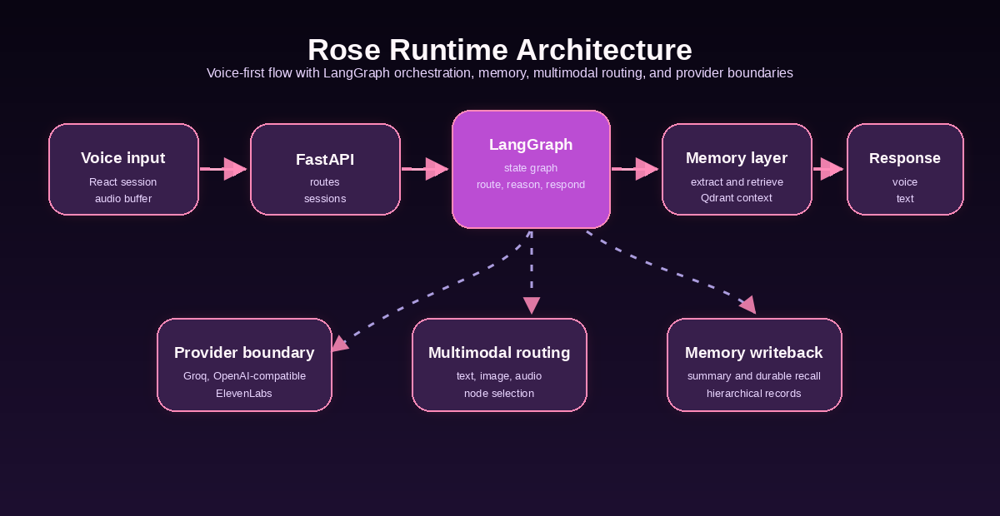
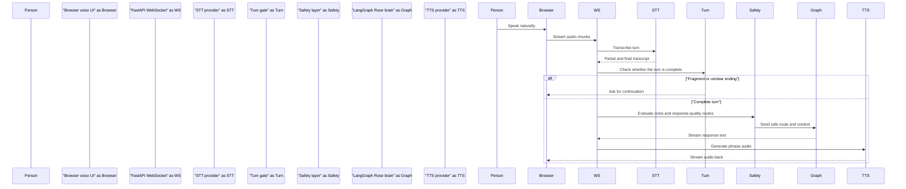
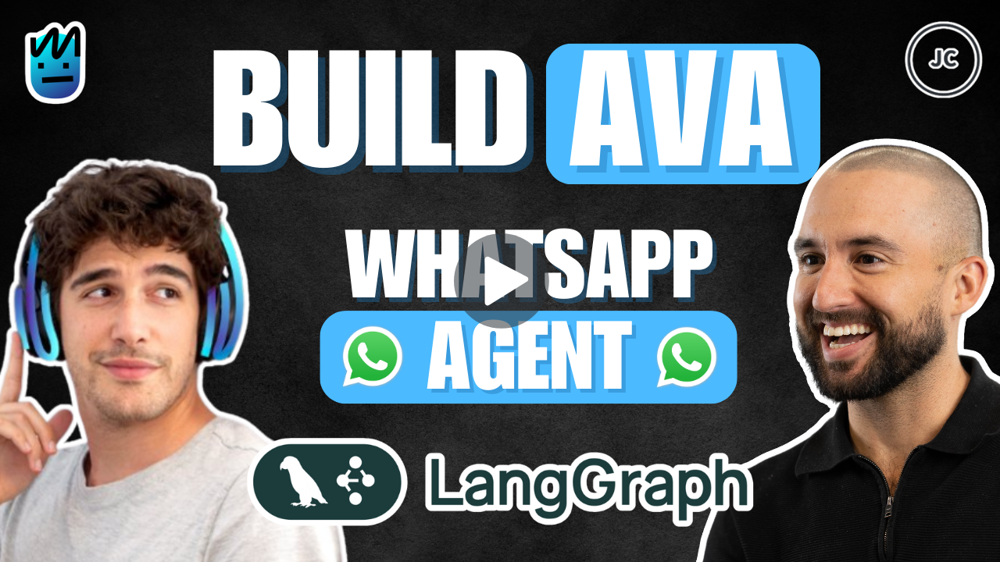

# Rose

<p align="center">
  <a href="https://github.com/Alexi5000/Rose">
    
  </a>
</p>

<p align="center">
  <strong>Voice-first AI emotional support for calm, reflective, and consent-aware conversations.</strong>
</p>

<p align="center">
  <a href="https://github.com/Alexi5000/Rose/actions/workflows/ci.yml"></a>
  <a href="LICENSE"></a>
  
  
</p>

<p align="center">
  <a href="#about-rose">About</a> |
  <a href="#safety-boundary">Safety</a> |
  <a href="#architecture">Architecture</a> |
  <a href="#quick-start">Quick Start</a> |
  <a href="#documentation">Docs</a> |
  <a href="#lineage">Lineage</a>
</p>

## About Rose

Rose is an open-source voice companion for emotional support, grounding, and reflective healing conversations. She combines a React and FastAPI voice interface, LangGraph orchestration, configurable AI providers, long-term memory controls, and deterministic crisis-safety handling.

Rose is AI emotional support. She is not a therapist, doctor, emergency service, or replacement for professional care. She can support reflection, grounding, spiritual language by consent, and continuity across sessions, but she must stay honest that she is AI and must route crisis language toward human help.

## What Rose Does

| Capability | Current implementation |
| --- | --- |
| Voice sessions | Browser microphone, WebSocket audio turns, interruption handling, and voice timing metrics. |
| LLM routing | Groq by default, OpenRouter as primary or fallback through an OpenAI-compatible API. |
| Speech to text | Groq Whisper batch transcription by default, Deepgram streaming STT as an optional low-latency provider. |
| Text to speech | ElevenLabs server-side voice, plus explicit text-only/browser speech degraded modes. |
| Memory | Qdrant-backed long-term memory with session-only, export, and forget controls. |
| Safety | Deterministic local crisis routing, false-positive recovery, and response-quality checks before normal generation. |
| Contributor flow | Focused tests, provider interfaces, docs, and upstream Ava lineage notes for professional PRs. |

## Safety Boundary

Rose is built for warmth without pretending to be clinical care. Safety rules are local and deterministic so they still work when external model providers fail.

- U.S. crisis language surfaces 988 and encourages immediate human help.
- Imminent external danger routes to emergency-services, safer-place, and trusted-contact guidance without self-harm wording.
- Rose avoids diagnosis, emergency replacement, therapy replacement, cultural authority claims, and unhealthy dependency pressure.
- Spiritual or ritual language must be opt-in and consent-aware.
- Logs default away from raw transcripts, memory text, audio paths, provider payloads, and secrets.

## Architecture

<p align="center">
  <a href="docs/VOICE_ARCHITECTURE.md">
    
  </a>
</p>



```mermaid
flowchart LR
    "Voice route" --> "STT provider"
    "Voice route" --> "Turn detection"
    "Turn detection" --> "Safety provider"
    "Safety provider" --> "LangGraph workflow"
    "LangGraph workflow" --> "LLM provider"
    "LangGraph workflow" --> "Memory provider"
    "LLM provider" --> "Groq default"
    "LLM provider" --> "OpenRouter fallback"
    "Memory provider" --> "Qdrant long-term memory"
    "Voice route" --> "TTS provider"
    "TTS provider" --> "ElevenLabs"
    "TTS provider" --> "text-only/browser speech degraded modes"
```

## Quick Start

```bash
git clone https://github.com/Alexi5000/Rose.git
cd Rose
cp .env.example .env
uv sync --extra test --extra streaming-stt
cd frontend
npm ci
cd ..
```

Add provider keys to `.env`.

```bash
GROQ_API_KEY="..."
ELEVENLABS_API_KEY="..."
ELEVENLABS_VOICE_ID="..."
QDRANT_URL="..."
QDRANT_API_KEY="..."

OPENROUTER_API_KEY="..."
LLM_PROVIDER="groq"
LLM_FALLBACK_PROVIDER="openrouter"

STT_PROVIDER="groq"
DEEPGRAM_API_KEY="..."

TTS_PROVIDER="elevenlabs"
LOG_SENSITIVE_CONTENT="false"
```

Run Rose locally.

```bash
python scripts/run_dev_server.py
```

The local app serves:

- Frontend: `http://localhost:3000`
- Backend API: `http://localhost:8000`
- API docs: `http://localhost:8000/api/v1/docs`

## Memory And Privacy

Rose can store selected long-term memories in Qdrant for continuity. Memory is sensitive data, so the app exposes session controls and keeps raw content out of logs by default.

```bash
curl -X POST "http://localhost:8000/api/v1/session/$SESSION_ID/memory-preferences" \
  -H "Content-Type: application/json" \
  -d '{"memory_mode":"session_only"}'

curl "http://localhost:8000/api/v1/session/$SESSION_ID/memory/export"

curl -X POST "http://localhost:8000/api/v1/session/$SESSION_ID/memory/forget"
```

Keep `LOG_SENSITIVE_CONTENT=false` unless you are debugging locally with explicit consent and a clear reason.

## Tests

Backend:

```bash
uv run ruff check src tests scripts
uv run ruff format --check src tests scripts
uv run mypy src/
uv run pytest tests/ -m "not slow and not integration" --cov=src --cov-fail-under=70
```

Frontend:

```bash
cd frontend
npm ci
npm run lint
npm test
npm run build
```

Focused suites:

```bash
uv run pytest tests/unit/test_crisis_safety.py tests/unit/test_response_quality.py -q --no-cov
uv run pytest tests/unit/test_llm_provider.py tests/unit/test_stt_provider.py tests/unit/test_tts_provider.py -q --no-cov
uv run pytest tests/unit/test_privacy_logging.py tests/unit/test_voice_websocket.py -q --no-cov
```

## Documentation

| Resource | Purpose |
| --- | --- |
| [Voice Architecture](docs/VOICE_ARCHITECTURE.md) | Current voice loop, provider boundaries, metrics, and interruption behavior. |
| [Provider Guide](docs/PROVIDERS.md) | Groq, OpenRouter, Deepgram, ElevenLabs, memory, and safety provider rules. |
| [API Documentation](docs/API_DOCUMENTATION.md) | HTTP and WebSocket API reference. |
| [Memory System](docs/MEMORY_SYSTEM.md) | Long-term memory, session controls, privacy, and retention behavior. |
| [Deployment Guide](docs/DEPLOYMENT.md) | Production deployment and operational notes. |
| [Ava Lineage Research](docs/AVA_LINEAGE_RESEARCH.md) | Upstream Ava history and contributor research. |
| [Upstream Lineage Research](docs/UPSTREAM_LINEAGE_RESEARCH.md) | Current upstream repository and PR review notes. |
| [Contributing](CONTRIBUTING.md) | How to propose safe, focused, contributor-friendly PRs. |

## Lineage

Rose is maintained from [Alexi5000/Rose](https://github.com/Alexi5000/Rose) and keeps visible credit to the Ava/Rose lineage from [neural-maze/ava-whatsapp-agent-course](https://github.com/neural-maze/ava-whatsapp-agent-course).

<p align="center">
  <a href="https://github.com/neural-maze/ava-whatsapp-agent-course">
    
  </a>
</p>

The image above links to the original Ava course repository so the source lineage remains visible. Rose also keeps integrated guidance from community pull requests in the original Ava course repository, with contributor notes in [CONTRIBUTORS.md](CONTRIBUTORS.md) and [upstream PR integration notes](docs/UPSTREAM_PR_INTEGRATION.md).

## License

Rose is released under the [MIT License](LICENSE).

<p align="center">
  <sub>Maintained by <a href="https://github.com/Alexi5000">Alexi5000</a>. Inspired by the original <a href="https://github.com/neural-maze/ava-whatsapp-agent-course">Ava course</a> and its source authors.</sub>
</p>
