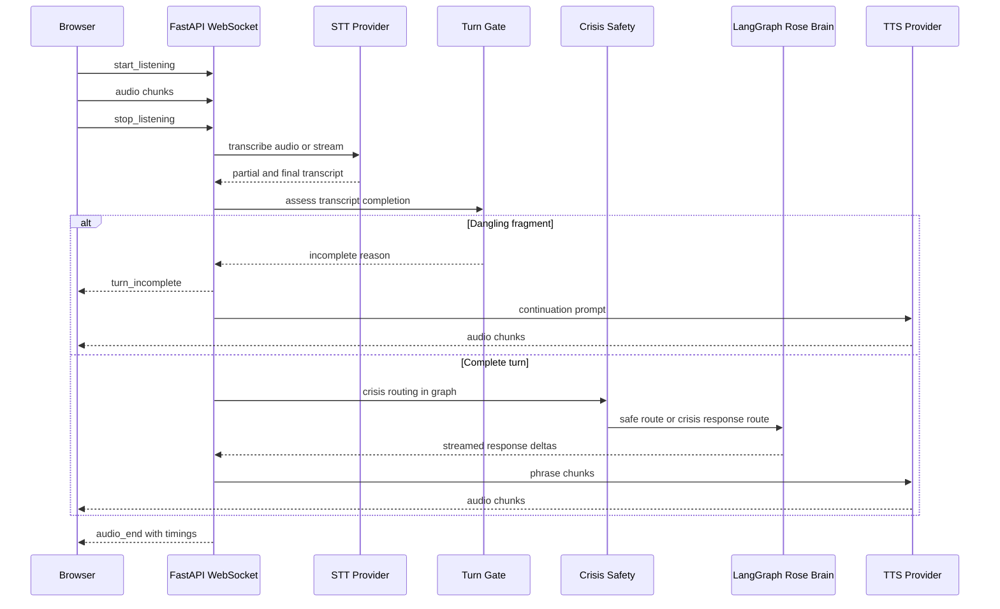
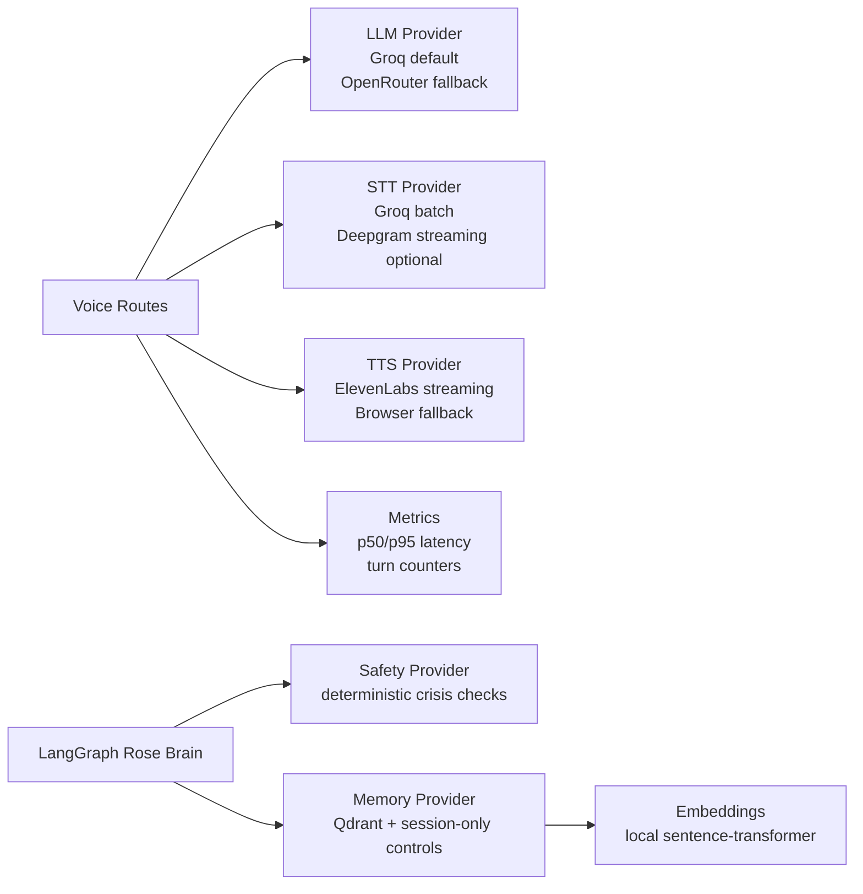

# Voice Architecture

Rose's voice path is built around fast, interruptible turns: get from microphone to first audio quickly, keep safety and
privacy checks close to the data, and preserve a clean provider boundary so contributors can improve one layer without
rewriting the whole companion.

## WebSocket Voice Turn

## Provider Boundaries

Provider details and tradeoffs live in [PROVIDERS.md](PROVIDERS.md).

## Design Rules

- Do not send raw transcripts, memory text, or audio payloads to logs unless `LOG_SENSITIVE_CONTENT=true` is explicitly
  enabled for a local consented debugging session.
- Keep Groq as the fast default LLM/STT path and treat OpenRouter as configurable fallback or alternate primary.
- Keep turn-taking conservative. A false continuation prompt is less harmful than Rose answering a half-sentence with
  misplaced certainty.
- Stream response text into TTS in phrase chunks so Rose can start speaking before the full answer is complete.
- Preserve barge-in. Interruptions must cancel queued speech and return the browser to listening without a full page or
  session reset.
- Record latency where users feel it: mic-to-first-audio and total turn time matter more than isolated provider timings.
